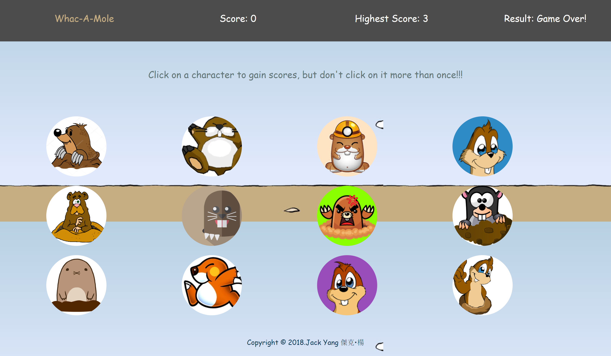

# Whac-A-Mole (Clicky Game)

A simple clicky Whac-A-Mole game built using React technologies.

1. The application will render different images to the screen. Each image listens for click events.

4. It keeps track of the user's score. The user's score will be incremented when clicking an image for the first time. The user's score will be be reset to 0 if they click the same image more than once.

5. Every time an image is clicked, the images rendered to the page will shuffle themselves in a random order.

6. Once the user's score is reset after an incorrect guess, the game will restart.

[Check It Out](http://jackjoeng.github.io/Whac-A-Mole).